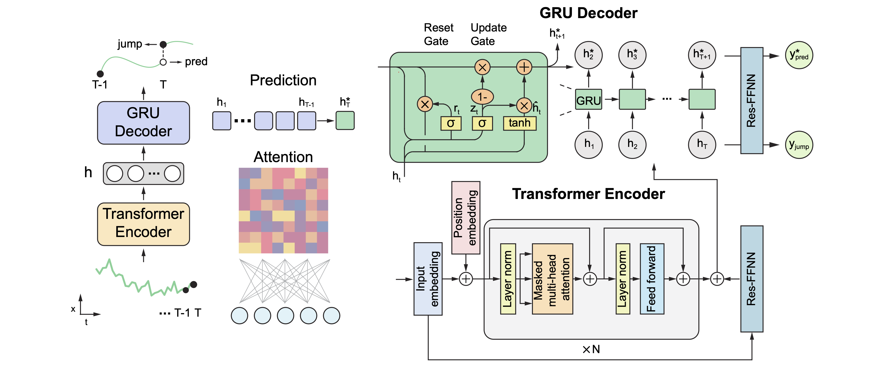

# SPINN

**SPINN**: Stochastic Particle-Informed Neural Network

## Description

**SPINN** is a Python framework for analyzing and modeling stochastic particle dynamics using physics-informed deep learning. The approach integrates stochastic differential equations (SDEs) into neural network architectures to enable automatic exploration of parameter spaces and separation of deterministic and stochastic components at single-frame temporal resolution.

The self-supervised method incorporates a physics-informed loss function that separates particle dynamics into:

- A time-dependent drift term derived from trajectory history, capturing deterministic motion patterns.

- A time-independent diffusion term representing stochastic fluctuations.

This decomposition enables label-free analysis of diffusive behavior through automatic parameter space exploration. The framework has been validated using the Anomalous Diffusion (AnDi) dataset and applied to analyze single gold nanorods diffusion during polymer gelation. Details of the method are presented in Zhang et al ("Physics-informed deep learning for stochastic particle dynamics estimation"). 

## Installation and dependencies

### Downloading the source

The official distribution is on GitHub, and you can clone the repository using

```
git clone https://github.com/EdwardZX/SPINN.git
```

### Dependencies

**SPINN** is tested on PyTorch 2.0.0 with Python 3.8 (Ubuntu 20.04) and CUDA 11.8.

Install PyTorch and Related Packages:

```
pip install torch==2.0.0 torchvision==0.15.1 torchaudio==2.0.1 --index-url https://download.pytorch.org/whl/cu118
```

Install other dependencies (NumPy, Matplotlib, Pandas, etc.):

```
pip install -r requirements.txt
```

## Getting started

### Prepare the Dataset

Create the `inputData/` directory under the `/data` folder to store your tracking data. The folder name (e.g., `inputData`) can be customized as needed:

```
data/
├── inputData/ # Place your tracking csv data files here
│   ├── trackers1.csv
│   ├── trackers2.csv
│   └── ...
```

SPINN accepts CSV files containing columns: `id_tracks`, `t`, `x`, and `y`, which are typically provided by **TrackMate** outputs from a TIFF sequence:

- `id_tracks`: trajectory identifier
- `t`: continuous frame numbers (0,1,2,3...)
- `x`: x-coordinate (pixels)
- `y`: y-coordinate (pixels)

Here's an example of what your CSV file should look like:

```
id_tracks,t,x,y
1,0,23.5,45.2
1,1,24.1,46.0
1,2,24.8,46.7
2,0,10.2,15.3
2,1,10.8,15.9
...
```

### Running the SPINN

The `run_SPINN.py` script processes trajectory data using SPINN. It can handle long (greater than 100 frames) or short trajectory data formats.

#### Basic Usage

**For Trajectories > 100 Frames**

To process trajectories that all are longer than 100 frames and save the output in CSV format, use the following command:

```
python run_SPINN.py --filename inputData --save_csv
```

**For shorter trajectories**
If your tracks are shorter than 100 frames, use the `csv_short` format. This will utilize a data pool to generate pseudo-trajectories while preserving the original microdynamics:

```
python run_SPINN.py --filename inputData --data_format csv_short --save_csv
```

### SPINN Results

When you run the `run_SPINN.py` script, the output files are organized in the following directory structure:

```
model_dir/
├── inputData/
│   ├── trackers1-SPINNResults.csv
│   ├── trackers2-SPINNResults.csv
│   └── ...
```


SPINN export CSV files containing columns:
- `id_tracks`: Unique identifier for each track.
- `frame`: Frame number in a sequence.
- `X` and `Y`: Current position coordinates.
- `Y1X` and `Y1Y`: Predicted next position coordinates.
- `VX` and `VY`: Drift velocity in the X and Y directions, respectively.
- `VarX` and `VarY`: Diffusion (variance) of in the X and Y directions, indicating the uncertainty in the predicted position

Here’s an example of what the content of a `trackers1-SPINNResults.csv` file might look like:

```
id_tracks,frame,X,Y,Y1X,Y1Y,VX,VY,VarX,VarY
0,14551,10.5,20.3,10.6,20.4,0.1,0.1,0.01,0.01
0,14552,10.6,20.4,10.7,20.5,0.1,0.1,0.01,0.01
0,14553,10.7,20.5,10.8,20.6,0.1,0.1,0.01,0.01
...
0,14587,14.5,24.3,14.6,24.4,0.1,0.1,0.01,0.01
```

## More details

### Algorithms Overview



SPINN uses history to analyze particle trajectory data through a Transformer-GRU architecture to extract the underlying motion dynamics, which embeds the trajectory in a high-dimensional space using multi-head attention to capture temporal dependencies. This embedded representation feeds into a GRU decoder that produces two main outputs: reconstruction of current positions and prediction of next frame positions. Raw drift term is calculated as (pred\_{t+1} - obs_t), and raw diffusion term is calculated as (obs\_{t+1} - pred\_{t+1})². These raw values are then trained through additional separate neural networks to produce more continuous drift and diffusion time series.

To make computing more efficient, a batch strategy is employed. An additional padding, consisting of the first h points before the start of each sub-trajectory (referred to as the header), is incorporated into the input embedding. This header is not used in the prediction process but ensures that every prediction value has access to more than h history information.

### Data Format & Structure in SPINN

The input csv data is tansfered and stored in NumPy (.npy) format with dimensions N × L × D, where N represents the number of tracks, L is the segment length, and D represents features. 

#### All mode (default)

**Data Preprocessing**: For convenience, the total length L is divided equally into encoding length (L_enc) and prediction length (L_pred), making L = L_enc + L_pred.
Two types of track segments are generated from the raw trajectories:

- Regular tracks (-tracks): Created by sliding an L_pred window size over raw trajectories
- Head tracks (-head-tracks): Generated by first padding initial coordination position of L_pred window size at the front of trajectories, then sliding an L_pred window size, ensuring L_pred frames overlap with regular tracks.

**Usage**
For training, SPINN uses only the regular tracks (-tracks) data, while both regular and head tracks are used during visualization to provide comprehensive trajectory analysis. 

```
data/
├── inputData
│   ├── normalized/ # Contains normalization information for each trajectory
│   │   ├──tracks1-tracks-Normalize-scale.npz
│   │   └── ...
│   ├── tracks1-tracks.npy
│   ├── tracks1-head-tracks.npy
│   ├── tracks2-tracks.npy
│   ├── tracks2-head-tracks.npy
│   └── ...
├── inputData_annotation.txt
├── inputData_annotation_visual.txt
```

The `normalized` directory contains the normalization information for trajectories in the tracks' file, both regular tracks (-tracks) and head tracks (-head-tracks). This includes the velocity norms and initial points of each trajectory, which are essential for denormalization since all tracks were normalized to have a unit displacement norm (dx = 1). The file `inputData_annotation.txt` specifies the location of the `-tracks.npy` file (e.g., `./data/inputData/tracks1-tracks.npy`). Additionally, the file `inputData_annotation_visual.txt` includes location to both the `-tracks.npy`and `-head-tracks.npy` files. The `process_and_save_tracks` or `process_and_save_tracks_short` function in `csv2npy.py` converts tracking data from a CSV format (containing `id_tracks`, `t`, `x`, and `y` coordinates in pixels) into the NPY format required by SPINN. 

When using .npy format as the input file format in All mode, CSV output functionality is not available. To access the full range of detailed outputs corresponding individual tracks files, simply copy the `inputData_annotation.txt` file and rename it to `inputData_annotation_visual.txt`

```
data/
├── inputData
│   ├── tracks1.npy
│   ├── tracks2.npy
│   └── ...
├── inputData_annotation.txt
├── inputData_annotation_visual.txt
```

#### Sample (evaluation) mode

SPINN utilizes the inputData folder for the complete dataset. The data in `inputData` is collectively loaded and later split into training and test sets during the training process. The test set is used for preview and evaluation. The file `inputData_annotation.txt` specifies the location of the NPY files (e.g., `./data/inputData/tracks1.npy`). Sample mode directory structure:

```
data/
├── inputData
│   ├── tracks1.npy
│   ├── tracks2.npy
│   └── ...
├── inputData_annotation.txt
```

### Advanced function  

#### Saving micro-dynamics

**All mode (default)**

To process trajectories, use the following command: 

```
python run_SPINN.py --filename inputData --data_format npy --save_micro all --save_csv
```

(Optional: saves CSV output)

The pipeline processes data in the following stages:

```
[Optional CSV Input] -> NPY -> NPZ (per file) -> Concatenated tracks (head-tracks + tracks) -> Output -> [Optional CSV Export]
```

When running finished, the output data is stored in `./model_dir/inputData` NumPy (.npz) format with L × N × D dimensions for raw time series, and L_pred × N × D for prediction time series. The NPZ file contains: ['x_raw', 's_raw', 'v_raw', 'y0', 'y1', 'sigma_run', 's1', 'v1', 'xlabel', 'sample_indices'] 

Raw Data:

- `x_raw`: Raw trajectory time series
- `s_raw`: Raw diffusion time series
- `v_raw`: Raw drift time series

Predictions:

- `y1`: Predicted trajectory time series
- `s1`: Predicted diffusion time series
- `v1`: Predicted drift time series

Other Parameters:

- `sigma_run`: Predicted residual value (obs\_{t+1} - pred_{t+1})
- `y0`: Reconstructed trajectory time series
- `xlabel`: Data labels (default: filename of each track file)
- `sample_indices`: Sampling indices if test shuffle

 The concatenation of tracks (head-tracks + tracks) is achieved using the function `load_microdynamics_tracks`. 

*When using .npy format as the input file format without data preprocessing in all mode, the output data is only saved to **NumPy (.npz)** format.*

```
 NPY -> NPZ (per file)
```

**Sample mode**

To process trajectories, use the following command: 

```
python run_SPINN.py --filename inputData --data_format npy --save_micro sample
```

The pipeline processes data in the following stages:

```
[Optional CSV Input] -> NPY -> NPZ (folder as a whole)
```

When the processing is complete, the output data is saved in **NumPy (.npz)** format at the following location `./model_dir/inputData_xxx_micro.npz`. The NPZ file contains: ['x_raw', 's_raw', 'v_raw', 'y0', 'y1', 'sigma_run', 's1', 'v1', 'xlabel', 'sample_indices'] 

#### Generated trajectories

The trained neural network extracts macroscopic statistical features through trajectory regeneration. Position updates combine neural network-derived displacements with stochastic fluctuations sampled from a Gaussian distribution parameterized by the diffusion time series. Generated data follows format N × L × D × S, where N represents the number of tracks, L is the segment length (time points), D represents features/dimensions per point, and S is the number of samples generated per trajectory.

**All mode**

To process trajectories generation in all mode, use the following command: 

```
python run_SPINN.py --filename inputData --data_format npy --save_micro all --gen_tracks --gen_tracks_num 20
```

(Optional: `--gen_tracks_num` defaults to 50 if not specified.)

**Sample mode**

To process trajectories generation in sample mode, use the following command: 

```
python run_SPINN.py --filename inputData --data_format npy --save_micro sample --gen_tracks --gen_tracks_num 20
```

(Optional: `--gen_tracks_num` defaults to 50 if not specified.)

Generated data is saved in the `./model_dir/[filename]-gen/memmap_gen/` directory.This includes shape_gen.npy for shape information, x0_gen.npy for generated positions, y0_gen.npy for generated reconstructed positions, and y1_gen.npy for generated predicted trajectories.

**Example: Loading Generated Trajectories**

```python
# Load shape information
shape_gen = np.load('./model_dir/'+filename+'-gen/memmap_gen/shape_gen.npy')

# Load initial positions and trajectory data
x_gen = np.load('./model_dir/'+filename +'-gen/memmap_gen/x0_gen.npy', 
               mode='r',dtype='float32',shape=(shape_gen[0],shape_gen[1],shape_gen[2],shape_gen[3]))
```

#### Visualization

To visualize predicted trajectories, use the following command:

```
python run_SPINN.py --filename inputData --sample_nums 1
```

### Help

For details about additional arguments and options, run:

```
python run_SPINN.py --help
```
The example data:
https://drive.google.com/file/d/1zAoiVxBXUHQ1Axez4qxsPuta1mrwLGAS/view?usp=sharing

## Reference

TODO: add citeable reference

## License

**SPINN** is [MIT-licensed](https://opensource.org/licenses/MIT); refer to the LICENSE file for more information.
